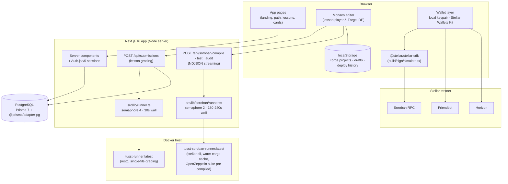
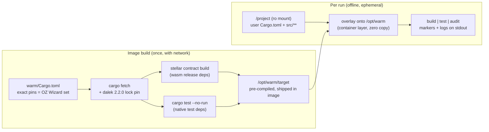
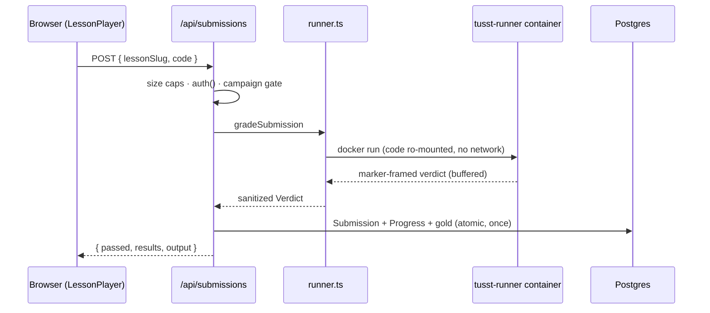
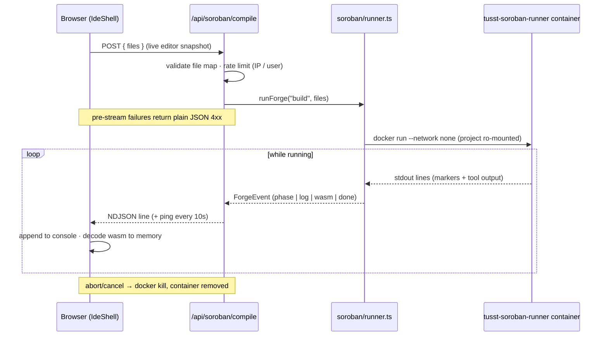
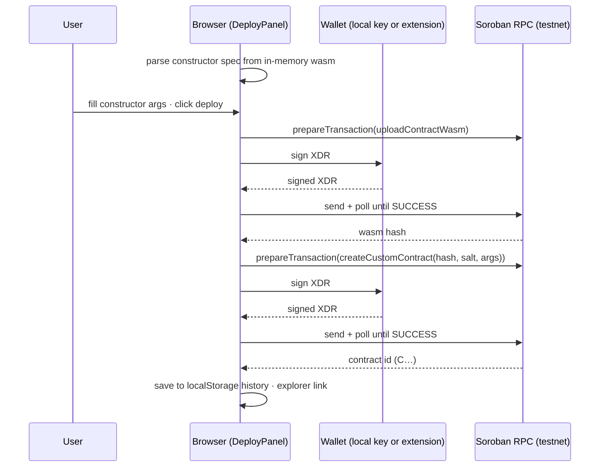
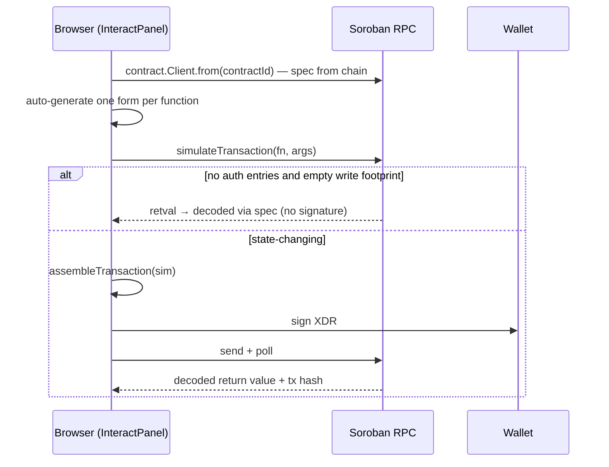

# TUSST Architecture

TUSST is a gamified platform for learning to build on **Stellar**, plus an
online IDE (**Forge**) for writing, testing and deploying **Soroban** smart
contracts from the browser. Everything ships as a single Next.js 16 app with
two hardened Docker sandbox images beside it.

> **Working on this codebase:** this project uses a Next.js version with
> breaking changes (route `params` are Promises, new route-handler and
> caching semantics). Check `node_modules/next/dist/docs/` before assuming
> classic Next.js behavior.

## 1. System Overview



Two principles shape the design:

- **The Docker sandbox is the security boundary.** User code is never
  executed, parsed or trusted on the host — it is written to a temp dir,
  mounted read-only into a locked-down ephemeral container, and only a
  marker-framed, sanitized, size-capped output stream comes back.
- **The server never touches keys.** Contract deployment and invocation are
  built, simulated and signed entirely in the browser; the backend only
  compiles and tests.

## 2. Components

### 2.1 Web app (`src/app`, `src/components`)

| Area | Route group | Notes |
| --- | --- | --- |
| Landing | `/` | own cinematic chrome |
| Product pages | `(app)/` — `/path`, `/cards`, `/lessons/[slug]`, `/tracks/[slug]`, `/profile`, `/login` | shared Nav + Footer |
| Forge IDE | `(ide)/` — `/ide` | full-viewport layout (Nav, no Footer); open access, no login required |
| API | `/api/auth/[...nextauth]`, `/api/submissions`, `/api/soroban/{compile,test,audit}` | route handlers |

- **Auth**: Auth.js v5 (`src/lib/auth.ts`) — GitHub / Discord / magic-link
  providers, JWT session strategy, Prisma adapter. `await auth()` is the one
  way sessions are read (server components and route handlers alike). A
  `Credentials` dev provider exists behind `AUTH_DEV_LOGIN=true` (never set
  in production).
- **Data**: Prisma 7 requires a driver adapter — the client is only ever
  instantiated in `src/lib/db.ts` (`PrismaPg` + `globalThis` singleton).
  Model highlights: `User` (with hidden `gold` / `goldRevealed` economy),
  `Track → Lesson → TestCase`, `Submission`, `Progress` (unique per
  user+lesson, gold credited exactly once via a guarded transaction),
  `Character`, `Skin`/`Inventory`.
- **Lesson player** (`src/components/LessonPlayer.tsx`): single-file Monaco,
  ⌘⏎ submit, localStorage drafts, sanitized verdict rendering.

### 2.2 Forge IDE (`src/components/ide`, `src/lib/soroban`, `src/lib/stellar`)

| Piece | Path | Responsibility |
| --- | --- | --- |
| Shell | `src/components/ide/IdeShell.tsx` | pane layout, project state, autosave |
| Editor | `EditorPane.tsx` | multi-file Monaco (one model per `path`) |
| Pipeline client | `use-forge-run.ts` | POST snapshot, parse NDJSON stream, hold wasm in memory |
| Console | `ConsolePane.tsx` | streamed logs, status badge, tail-pinning |
| Wallet | `WalletMenu.tsx` + `src/lib/stellar/wallet.ts` | local keypair or Wallets Kit behind one `ForgeWallet` interface |
| Deploy | `DeployPanel.tsx` + `src/lib/stellar/deploy.ts` | 2-tx deploy, constructor form from wasm spec |
| Interact | `InteractPanel.tsx` + `src/lib/stellar/invoke.ts` | spec from chain, auto-generated forms, simulate-then-sign |
| Server runner | `src/lib/soroban/runner.ts` | spawn container, parse markers, enforce caps |
| Validation | `src/lib/soroban/validate-files.ts` + `paths.ts` | file-map rules (shared client/server) |
| Rate limit | `src/lib/soroban/rate-limit.ts` | in-process token bucket per IP / user |
| Templates | `src/content/soroban-templates.ts` | hello-world, OZ fungible, OZ NFT, blank — all on the curated manifest |
| Persistence | `src/lib/forge-store.ts` | versioned localStorage schema (`tusst:forge:v1:*`) |

Projects are **client-side only** in v1 (localStorage, versioned keys so a
later DB sync can migrate). The build API therefore receives the live editor
snapshot (`{ files }`), never a project id — unsaved edits always compile.

### 2.3 Sandbox images

Both images follow the same posture: non-root user (uid 10001), no network
at runtime, capability-dropped, resource-limited, host-enforced wall timeout
with `docker kill`, and a marker protocol on stdout that the host parses and
sanitizes (host paths stripped, output capped).

| | `runner/` (lessons) | `runner-soroban/` (Forge) |
| --- | --- | --- |
| Toolchain | `rustc` only | stable Rust + `wasm32v1-none` + pinned stellar-cli |
| Input | one `main.rs` | `Cargo.toml` + `src/**` (≤32 files, ≤512KB) |
| Command | compile + run with inner `timeout` | `stellar contract build` · `cargo test` · `cargo scout-audit` |
| Output protocol | `__TUSST_COMPILE__ / __TUSST_RUN__ / __TUSST_STDOUT__` (buffered) | `__TUSST_FORGE__ phase/result/wasm-begin…end` (streamed; wasm as base64) |
| Rootfs | `--read-only` + tmpfs | writable **ephemeral layer** (see below) |
| Wall timeout | 30s | 180s build / 240s test·audit |

**The warm-cache trick** (what makes OpenZeppelin pastes "just work"):
`runner-soroban/warm/Cargo.toml` pins the exact crate set the OZ Contract
Wizard emits (`soroban-sdk =26.1.0`, the `stellar-*` OZ suite `=0.7.2`,
plus `sep-41-token`, `soroban-fixed-point-math`). At image build time the
whole set is fetched and pre-compiled for both the wasm release profile and
the native test profile. At runtime the container swaps the user's sources
into `/opt/warm` and builds **offline** (`--network none`,
`CARGO_NET_OFFLINE`) — dependency artifacts are reused because cargo
fingerprints don't include the leaf package name. Builds finish in seconds.



Two deliberate deviations in the Forge image, and why:

- **No `--read-only`**: copying the ~1GB warm `target/` into a tmpfs would
  charge the cgroup memory limit and be slow; building in-place in the
  container's ephemeral overlay layer reuses it with zero copy, and `--rm`
  discards every write. Isolation still comes from no-network, cap-drop,
  non-root, pids/memory/cpu limits and the wall timeout.
- **Scout audit is gated**: the image installs `cargo-scout-audit`, but the
  entrypoint only runs it if the Dockerfile's priming run succeeded (marker
  `/opt/scout-ready`). As of scout 0.3.16 it builds contracts for
  `wasm32-unknown-unknown`, which soroban-sdk ≥26 rejects on Rust ≥1.82 —
  so audit currently reports "temporarily unavailable" and re-enables by
  bumping `SCOUT_AUDIT_VERSION` once a compatible release ships.

Version pins that matter (all in `runner-soroban/`): stellar-cli via
`ARG STELLAR_CLI_VERSION`; `ed25519-dalek` locked to `2.2.0` in the shipped
`Cargo.lock` (3.x breaks soroban-env-host's testutils; the upstream
requirement is an open `>=2`); the warm manifest **must stay in sync** with
`src/content/soroban-templates.ts` and with what the OZ Wizard emits.

## 3. Data Flows

### 3.1 Lesson submission (grading)



### 3.2 Forge compile / test (streaming)



### 3.3 Deploy to testnet (non-custodial, two transactions)



### 3.4 Invoke (read vs write decided by simulation)



## 4. Deployment & Infrastructure

The app is a standard Next.js server (`npm run build && npm start`). The
constraint is Docker: **the sandboxes cannot run on Vercel** — serverless
hosts have no Docker daemon.

| Setup | What works |
| --- | --- |
| Vercel + hosted Postgres | site, auth, lessons with `RUNNER_MODE=regex`; Forge API answers "the forge is cold" |
| Single VPS with Docker (≥8GB RAM) | everything — build both images, `RUNNER_MODE=docker` |
| Split (future) | app on Vercel + runner service behind a queue (BullMQ/Redis); the `AsyncIterable<ForgeEvent>` contract already survives that swap |

Setup on a Docker host:

```bash
npm run db:up                    # local Postgres (docker compose)
npx prisma migrate deploy && npx prisma db seed
docker build -t tusst-runner:latest ./runner
npm run runner:soroban:build     # tusst-soroban-runner:latest (~15-30 min first time, ~6GB)
npm run build && npm start
```

Environment variables:

| Variable | Purpose |
| --- | --- |
| `DATABASE_URL` | Postgres connection string |
| `AUTH_SECRET` | `openssl rand -base64 32` |
| `AUTH_URL` | canonical app URL |
| `AUTH_GITHUB_ID/SECRET`, `AUTH_DISCORD_ID/SECRET`, `AUTH_EMAIL_SERVER/FROM` | login providers (register two OAuth apps: dev callback on localhost, prod on the real domain) |
| `RUNNER_MODE` | `docker` or `regex` — lessons only; the Forge always uses Docker |
| `AUTH_DEV_LOGIN` | **local dev only** — never set in production |

The Forge needs **no env vars**: testnet endpoints (RPC, Horizon, Friendbot,
network passphrase) are public constants in `src/lib/stellar/network.ts`,
and rate limiting is in-process.

## 5. Security Considerations

- **Untrusted code execution** — the entire threat model funnels into the
  container: `--network none`, `--cap-drop ALL`,
  `--security-opt no-new-privileges`, pids/memory/cpu limits, non-root user,
  read-only project mount, host wall timeout with `docker kill` (also fired
  when the client aborts the request). One throwaway container per run; no
  state survives `--rm`.
- **Output hygiene** — everything the sandbox prints is treated as hostile:
  parsed line-by-line against expected markers, host paths rewritten, capped
  (2k lines / 512KB logs, 5MB wasm), truncated with notice beyond that.
- **Manifest scanning is UX, not security** — `path =`/`git =`/`[patch]`
  dependencies are rejected with a friendly message because they can't
  resolve offline; nothing security-critical depends on that scan.
- **Abuse control** — request body caps before buffering, per-IP token
  bucket (signed-in users get a higher bucket via `await auth()`), and a
  small in-process semaphore so concurrent builds can't exhaust the host.
- **Keys** — the server has no signing path at all. The local-wallet mode
  stores its secret in the user's localStorage with an explicit
  "testnet only" warning; real funds belong in extension wallets, which sign
  via the Wallets Kit without exposing secrets to the page.
- **Auth economy invariants** — gold is credited inside a transaction that
  flips `Progress.completed` exactly once; concurrent passing submissions
  can't double-credit (unique constraint + conditional update).
- **Accepted v1 risks (documented)** — a hostile `build.rs` can burn CPU and
  container-layer disk until the wall timeout kills it (bounded by rate
  limits; monitor disk on the Docker host). The Forge image drops
  `--read-only` in exchange for the zero-copy warm cache, compensated by the
  remaining container hardening.
