<div align="center">

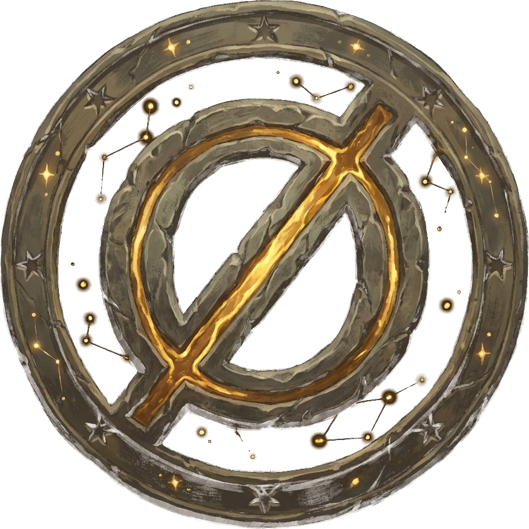

# TUSST — The Ultimate Stellar Supreme Tutorial

**An open-source RPG for learning Rust and Soroban smart contracts on Stellar.**

Play an eight-act campaign against the Stroopbeholder — and the echo it left behind:
master Rust fundamentals, cross the Constellation Gate into the Stellar ecosystem, and
forge real Soroban contracts that compile, run, and deploy to the Stellar testnet — all
in the browser.

[](https://github.com/pedro-pelicioni/tusst/actions/workflows/ci.yml)
[](https://github.com/pedro-pelicioni/tusst/actions/workflows/rust.yml)
[](LICENSE)

### [▶ Play it live at tusst.xyz](https://tusst.xyz)

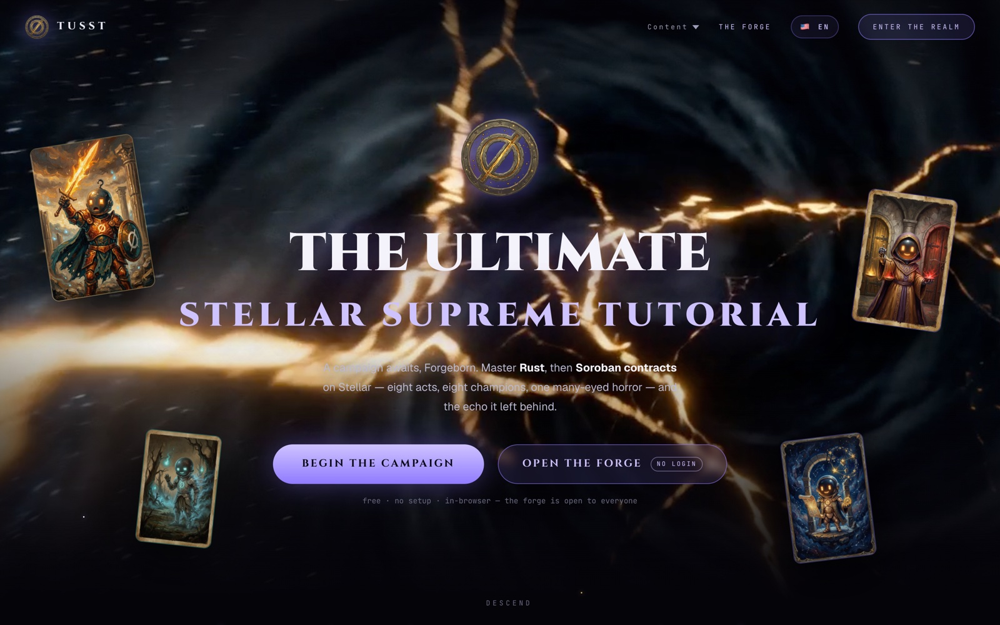

</div>

---

## Why

Stellar's learning content is scattered across projects that are loved but aging —
[Stellar Quest](https://quest.stellar.org), [RPCiege](https://rpciege.com),
[FCA00C](https://fastcheapandoutofcontrol.com). TUSST consolidates that experience into a
single, modern, maintained, self-hostable home: hands-on browser practice in the spirit of
Rustfinity, wrapped in RPG progression in the spirit of Node Guardians, with card-collecting
lore as a tribute to RPCiege. It is built toward a Stellar Community Fund proposal.

## The campaign

**The Shattered Constellation** — 8 acts, 39 skirmishes (lessons), 8 collectible champion
cards. Each act is a territory with its own overlord; clear its final skirmish and the
act's champion joins your collection. Acts unlock in order (your onboarding answers can
grant a head start), and the last two must be *earned* — they never unlock by onboarding.

| Act | Territory | What you learn |
|-----|-----------|----------------|
| I | The Rusted Citadel | Rust fundamentals — variables, types, functions, ownership of the basics |
| II | The Hall of Forking Roads | Control flow — `if`, `match`, loops, patterns |
| III | The Endless Vaults | The Rust standard library — collections, strings, iterators |
| IV | The Vanishing Marsh | `Option` — the value that may not be there |
| V | The Trial of Two Fates | `Result` — errors as values |
| VI | The Constellation Gate | Stellar 101 — keypairs, lumens & stroops, trustlines, payments |
| VII | The Beholder's Lair 👁 | Soroban smart contracts — `contractimpl`, storage, auth |
| VIII | The Rewritten Sky | Protocol 27 — CAP-71 delegated account auth and the replay attack it fixed |

<p align="center">
  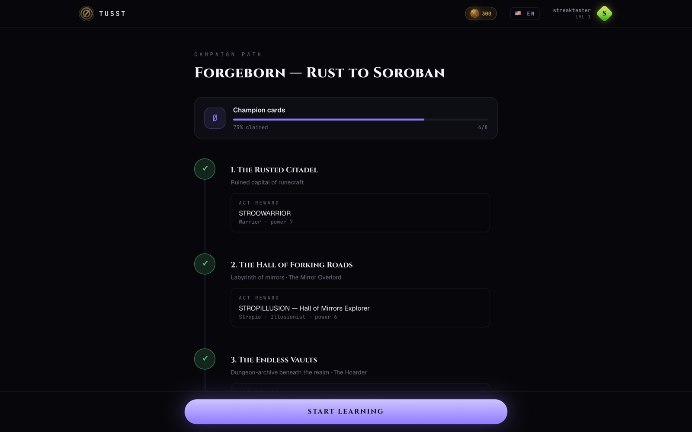
  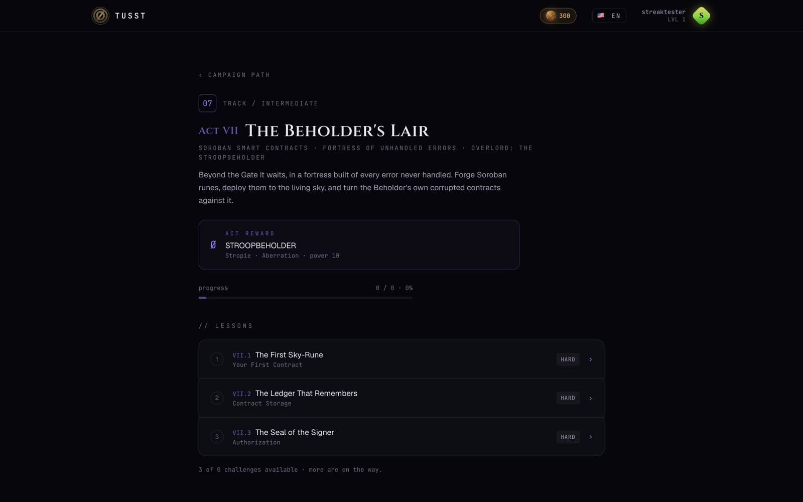
</p>

## Lessons that actually run your code

Lessons are bite-sized, Mimo-style step flows — theory cards with the mascot, quizzes,
fill-in-the-blanks — capped by a real coding challenge in a Monaco editor (⌘⏎ to run,
drafts persist locally, and you can rewind through completed steps).

<p align="center">
  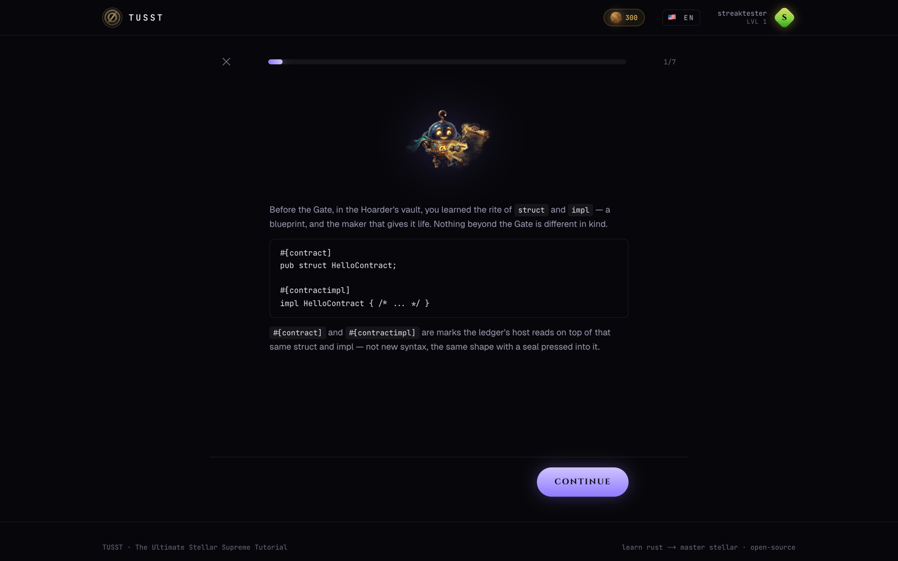
  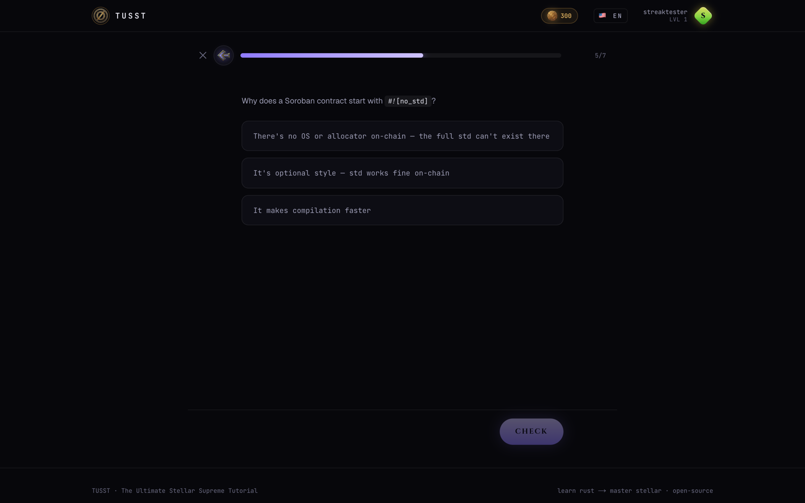
</p>

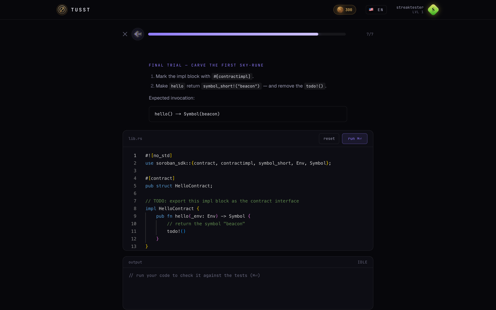

Submissions are graded for real, not with regex theater. Your code is compiled with
`rustc -D warnings` and executed inside a hardened, throwaway Docker container:

```
--network none  --read-only  --tmpfs /tmp:rw,exec,size=256m
--cap-drop ALL  --security-opt no-new-privileges
--pids-limit 128  --memory 512m  --cpus 1
```

…with a 5-second run timeout, a 30-second wall clock, and structural AST checks
(the `tusst-syntest` crate) so code that games the expected output still fails honestly.
Conceptual lessons (Stellar 101 configs, contract stubs) grade with lightweight checks and
need no container. The first lesson is playable — and gradeable — **without an account**.

> 🪙 **Design note — the hidden gold economy.** Gold accrues silently from your first
> completed lesson, but no currency, shop, or inventory UI exists anywhere until your
> first completion reveals it. The product never primes "gold farming" up front.

## Champions, profile, progression

<p align="center">
  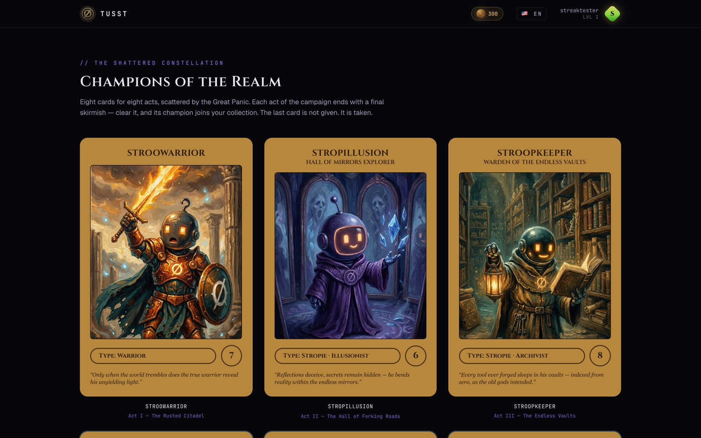
  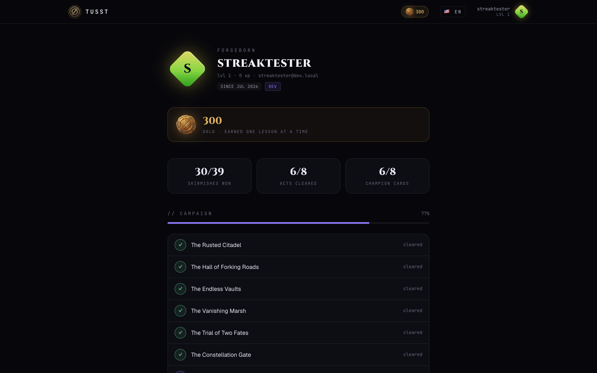
</p>

## The Forge — a Soroban IDE in your browser

Open [`/ide`](https://tusst.xyz/ide) and you're writing smart contracts. **No login, no
setup, no faucet hunting.**

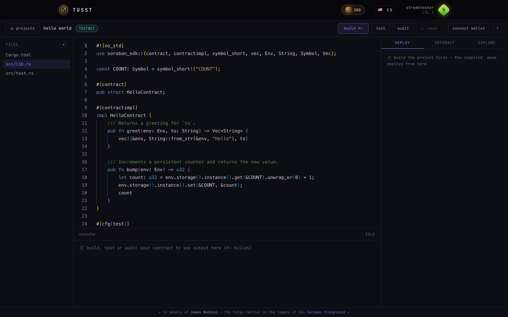

- **Build · Test · Audit** — streamed live from a hardened Docker sandbox with a
  pre-warmed cargo cache, so an OpenZeppelin contract pasted cold compiles in seconds.
  (`cargo scout-audit` is temporarily gated by an upstream incompatibility with
  soroban-sdk ≥ 26.)
- **Templates** — hello world, OpenZeppelin fungible token, OpenZeppelin NFT, or blank.
- **Import from GitHub** — paste a repo URL, get a project (size-checked before download).
- **Wallet** — a browser-local testnet keypair (with export/import and a clear warning) or
  your real wallet via Stellar Wallets Kit; Friendbot funding built in.
- **Deploy** — non-custodial two-transaction deploy (upload wasm → create contract) with a
  constructor form generated from the wasm spec. Keys never touch the server.
- **Interact & Explore** — load any deployed contract's spec from chain and get one
  auto-generated form per function; read-only calls simulate without signing.
- **Phones & tablets** get a compact editor ⇄ console layout with its own tutorial.

The Forge footer says it best: *in memory of James Bachini — the Forge carries on the
legacy of his Soroban Playground.*

## The Raven — an AI mentor that won't do your homework

Fail a skirmish and you can ask the Raven 🐦‍⬛ for a hint. It reads your graded submission
server-side (the client can't forge context), answers Socratically in your language —
never the full solution — and, for Stellar-domain lessons and Forge errors, grounds its
hints in **official Stellar docs fetched via the Raven MCP server**. Works with any
OpenAI-compatible endpoint (defaults to GitHub Models' free tier), rate-limited per
lesson/user/day, and degrades gracefully to the lesson's authored hints when the provider
is down. Hidden grading checks are never sent to the model; your code is treated as
untrusted input.

## Four languages

English, Português, Español, Français — UI and lesson content, cookie-based with per-key
fallback to English. Your language choice survives signup and follows your account.

---

## Getting started

Prerequisites: **Node 22+**, **Docker** (Postgres, plus the sandboxes if you want real
grading), npm.

```bash
git clone https://github.com/pedro-pelicioni/tusst.git
cd tusst
cp .env.example .env      # then: npx auth secret → AUTH_SECRET, and set AUTH_DEV_LOGIN="true"
npm install               # postinstall runs `prisma generate`, so .env must exist first
npm run db:up             # Postgres 17 in Docker
npx prisma migrate deploy
npm run db:seed           # 8 tracks, 39 lessons, demo user
npm run dev               # → http://localhost:3000
```

With `AUTH_DEV_LOGIN="true"` (dev-only; hard-disabled in production builds), the login
page gets a name-only credentials form — type any name and you're in. The seeded `demo`
user starts with the first three lessons cleared.

### Real code execution (optional but recommended)

By default (`RUNNER_MODE=regex`) only conceptual lessons grade; Rust lessons report that
the sandbox is unavailable. To grade for real:

```bash
npm run runner:build              # lesson sandbox image (~1 GB)
# and in .env:
RUNNER_MODE="docker"
```

For the Forge's build/test pipeline (the in-browser deploy/interact features work without
it):

```bash
npm run runner:soroban:build      # Forge sandbox image — large; first build takes a while
```

### AI mentor (optional)

Set `MENTOR_API_KEY` (a GitHub fine-grained PAT with *Models: read* works on the free
tier) and the hint button appears; leave it unset and the feature hides itself. Optional:
`MENTOR_BASE_URL` / `MENTOR_MODEL` for any OpenAI-compatible provider, and
`node scripts/raven-auth.mjs` for one-time OAuth consent to the Raven MCP docs grounding.

### All scripts

| Script | What it does |
|--------|--------------|
| `npm run dev` / `build` / `start` / `lint` | The usual Next.js suspects |
| `npm run db:up` | Start Postgres 17 via docker compose |
| `npm run db:migrate` | Create/apply a dev migration |
| `npm run db:seed` | Idempotent seed (tracks, lessons, demo user) |
| `npm run db:studio` | Prisma Studio |
| `npm run db:reset` | Drop, re-migrate, re-seed |
| `npm run runner:build` | Build the lesson-grading sandbox image |
| `npm run runner:soroban:build` | Build the Forge (Soroban) sandbox image |

### Environment variables

| Variable | Gates |
|----------|-------|
| `DATABASE_URL` | Postgres connection (Prisma 7 driver adapter) |
| `AUTH_SECRET` / `AUTH_URL` | Auth.js core |
| `AUTH_DEV_LOGIN` | Name-only dev login (ignored when `NODE_ENV=production`) |
| `AUTH_GITHUB_ID` + `AUTH_GITHUB_SECRET` | GitHub OAuth (provider registers only if both set) |
| `AUTH_DISCORD_ID` + `AUTH_DISCORD_SECRET` | Discord OAuth |
| `AUTH_EMAIL_SERVER` + `AUTH_EMAIL_FROM` | Email magic-link sign-in |
| `RUNNER_MODE` | `docker` = real grading, `regex` = conceptual lessons only |
| `RUNNER_REMOTE_URL` + `RUNNER_SHARED_SECRET` | Forward grading to a Docker-capable host (serverless deploys) |
| `NEXT_PUBLIC_FORGE_RUNNER_URL` + `FORGE_CORS_ORIGIN` | Point the browser's Forge calls at a separate runner host |
| `MENTOR_API_KEY` / `MENTOR_BASE_URL` / `MENTOR_MODEL` | AI mentor (unset = feature off) |
| `RAVEN_MCP_URL` | Override the Stellar docs MCP endpoint |

## How it works

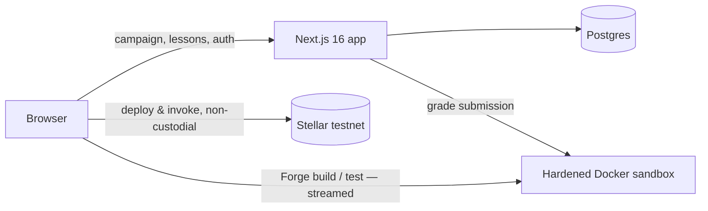

Two principles govern the design: **the Docker sandbox is the security boundary** (every
flag it runs with is listed above and in the docs), and **the server never touches keys** —
deploys and invocations are built, simulated, and signed entirely client-side.

The full system design — route map, both sandbox images, the warm-cache trick, sequence
diagrams for grading/compile/deploy/invoke, and deployment options — lives in
**[ARCHITECTURE.md](ARCHITECTURE.md)**.

## Repository layout

```
src/
  app/                 # routes: landing, onboarding, /path, /tracks, /lessons, /cards,
                       #         /profile, /login, /ide, and the API (submissions,
                       #         soroban pipeline, mentor, auth)
  components/          # shared UI, landing, onboarding, and 16 Forge modules
  content/             # the campaign: tracks, acts & cards, lesson steps (client-safe),
                       #   full lesson content + hidden checks (server-only), i18n overlays
  i18n/                # locale plumbing + UI message catalogs (en/pt/es/fr)
  lib/                 # auth, db, runner, grading, unlock ratchet, mentor, soroban, stellar
prisma/                # schema, migrations, idempotent seed
runner/                # lesson sandbox: Dockerfile + grader crates (tusst-runner, tusst-syntest)
runner-soroban/        # Forge sandbox: Dockerfile, entrypoint, pre-warmed dependency cache
deploy/                # reviewable copy of the VPS deploy script
.github/               # CI (no secrets on PRs), gated deploy, cargo-audit, dependabot, CODEOWNERS
```

## Deployment

The reference production topology is **Vercel** (site) + **Neon** (Postgres) + a small
**Docker-capable VPS** (both sandbox images behind a shared-secret endpoint, with the
browser's Forge calls going straight to the runner host). A single VPS running everything
works too — see [ARCHITECTURE.md §4](ARCHITECTURE.md).

CI/CD is deliberately conservative: PR validation carries no secrets; production deploys
run only from `main` with Neon migrations gated behind a drift check and a required
reviewer; the VPS accepts a single forced SSH command and auto-rolls-back on a failed
health check; `cargo audit` runs weekly over both Rust workspaces.

## Security

The sandbox that executes learner code is the highest-impact surface in the project — its
isolation flags are documented, and a dropped flag is exactly the kind of finding we want
reported. Please use GitHub **private vulnerability reporting**, not public issues:
**[SECURITY.md](SECURITY.md)**.

## Roadmap

Shipped: the full eight-act campaign, step-based lesson player, Docker grading, the hidden
gold reveal, champion cards, the Forge (build/test/deploy/interact), the AI mentor with
MCP docs grounding, and four languages.

Next, roughly in order:

- **Skins & inventory** — the gold sink; the data model is already in the schema.
- **The lore book** — the world of the Shattered Constellation, written down.
- **Deeper grading** — full `cargo test` harnesses and a job queue for scale.
- **Scout audit re-enabled** in the Forge once it supports soroban-sdk ≥ 26 targets.
- **More Stellar tracks** — beyond the campaign, into the ecosystem.

## Contributing

Issues and PRs are welcome. There's no CONTRIBUTING.md yet, so the short version:

- `npm run lint && npm run build` must pass (that's exactly what CI runs on your PR).
- Lesson content lives in `src/content/` — steps are client-safe by design; anything that
  could leak an answer belongs in the `server-only` modules.
- Translations live in `src/i18n/messages/` (UI) and `src/content/i18n/` (lessons); two
  lessons currently fall back to English and would love a translator.
- Sensitive paths (`prisma/`, `runner*/`, workflows, `deploy/`) require code-owner review.

## License

[Apache-2.0](LICENSE) © 2026 Pedro Pelicioni. Built toward a Stellar Community Fund
proposal — and in tribute to the projects that taught Stellar before us.
